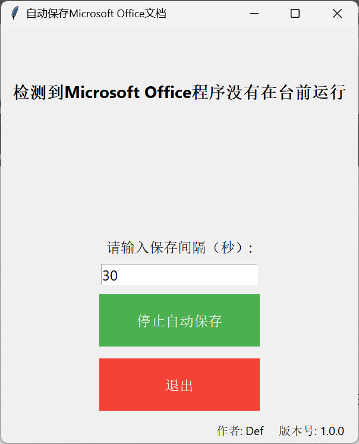
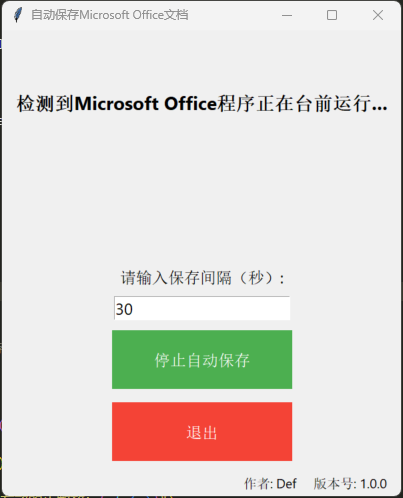
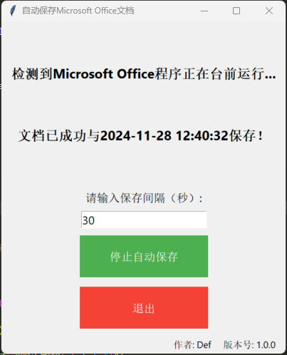

# Office_Auto_Save
Save your Microsoft Office apps (Word, Excel, PowerPoint) automatically

## Install necessary python packages

```shell
pip install psutil pyautogui pygetwindow
```

## Package the python script into an exe file

```shell
pip install pyinstaller
pyinstaller --onefile office_auto_save.py
```

## Performance



